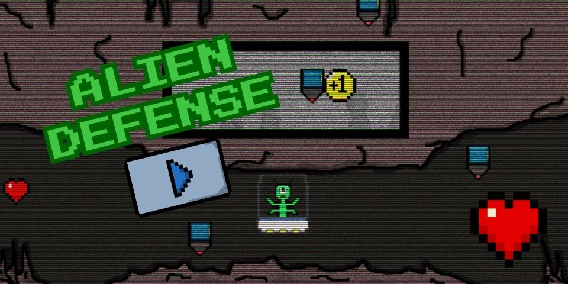

# ALIEN DEFENSE

Welcome to **Alien Defense**, my first video game! This project was built using the Phaser.io library (version 2.8.3). I designed and programmed everything from scratch.

## 📋 Table of Contents

- [Overview](#overview)
  - [Screenshot](#screenshot)
  - [How to Play](#how-to-play)
  - [Links](#links)
- [🚀 Project Structure](#project-structure)
  - [Built With](#built-with)
- [🧞 Commands](#commands)
- [👤 Author](#author)

## Overview

### Screenshot



### How to Play

- Use the **arrow keys** to move.
- Note: The volume cannot be adjusted (sorry about that! 😬).

Enjoy the challenge and defend the planet!

### Links

- Live Site URL: <a href="https://danielmontes9.github.io/alien-defense/" target="_blank">Play Alien Defense</a>

## 🚀 Project Structure

Here’s the structure of the project files and folders:

```plaintext
.
├── js/
│   ├── GAME.js
│   ├── GameOver.js
│   ├── initial.js
│   ├── Main.js
│   └── phaser.js
├── resources/
│   ├── audio/
│   │   ├── effects/
│   │   │   └── fix-mixdown.ogg
│   │   ├── music/
│   │   │   └── melodyloops-adrenaline.mp3
│   ├── css/
│   │   └── style.css
│   ├── images/
│   │   ├── alien.png
│   │   ├── bg.jpg
│   │   ├── button.png
│   │   ├── canon.png
│   │   ├── coin.png
│   │   ├── heart.png
│   │   ├── missile.png
│   │   ├── pause.png
│   │   └── screenshot-alien-defense.png
└── index.html
```

### Built With

- **HTML5**
- **Canvas**
- **CSS**
- **JavaScript**
- [Phaser.io](https://phaser.io/)

## 🧞 Commands

```bash
# Clone the repository
git clone https://github.com/danielmontes9/alien-defense.git

# Open the game in your browser
open index.html
```

## 👤 Author

- **GitHub**: [@danielmontes9](https://www.github.com/danielmontes9)
- **Dev.to**: [@danielmontes9](https://www.dev.to/danielmontes9)

Feel free to check out my other projects or reach out for collaboration!

---

Thanks for stopping by and trying out **Alien Defense**! 👽
